# 🛸 Painel de Controle — ALE-RR 2026
**"O sucesso é o somatório de pequenos esforços repetidos dia após dia."**

---

> [!ABSTRACT] 📊 Status Geral do Projeto
> | Dias para Prova | Fase Atual | Tópicos Cobertos | Meta Semanal |
> | :---: | :---: | :---: | :---: |
> | **70 dias** | 🟢 **Diagnóstico** | **18%** | 2,5 tópicos/dia |

---

## 📅 Consistência (Heatmap)
> Visualização do esforço diário. O tom de verde aumenta com as horas de estudo.

```dataviewjs
const pages = dv.pages('"30_Dominio_Intelectual/04_Logs"').where(p => p.tipo == "diario");
const calendarData = {
    year: 2026,
    colors: {
        green: ["#c6e48b", "#7bc96f", "#49af5d", "#2e8840", "#196127"],
    },
    entries: []
};

for (let page of pages) {
    if (page.horas_estudo) {
        calendarData.entries.push({
            date: page.file.name.split(" ")[2] || page.file.name, // Ajuste para pegar data do nome se necessário
            intensity: page.horas_estudo,
            content: await dv.span(`[🔗](${page.file.path})`)
        });
    }
}

renderHeatmapCalendar(this.container, calendarData);
```

---

## ⚡ Metas e Tarefas (Hoje)
> Tarefas gerenciadas pelo plugin **Tasks**.

```tasks
not done
due on or before today
short mode
```

---

## ⚡ Atalhos Rápidos

```button
name 📓 Novo Diário de Estudo
type command
action Templater: Create new note from template
color blue
```
```button
name 🎯 Registrar Simulado
type command
action Templater: Create new note from template
color green
```
```button
name 🧪 Área do ERP SaaS
type link
action [[20_Dominio_Profissional/02_Projetos/ERP_Construtora_SaaS]]
color purple
```

---

## 📈 Progresso Visual por Matéria

```mermaid
gantt
    title Cobertura do Edital (Beast Mode)
    dateFormat  X
    axisFormat %
    
    section Específicas
    AFO (80%)           :active, a1, 0, 80
    Proc. Leg (42%)     :active, a2, 0, 42
    Legística (75%)     :active, a3, 0, 75
    RI ALE-RR (0%)      :a4, 0, 0
    Dir. Adm (0%)       :a5, 0, 0
    
    section Gerais
    Português (0%)      :b1, 0, 0
    Matemática (0%)     :b2, 0, 0
    Informática (0%)    :b3, 0, 0
```



---

## 🔍 Temas Críticos (Gaps de Estudo)
> [!CAUTION] **Focar nestes assuntos nos próximos 3 dias:**
> - **AFO:** Regime Contábil (Receita = Caixa) e LDO vs LOA.
> - **PROC. LEG:** Vedações de PEC e Poderes das CPIs.
> - **MP:** Prazos e vedações de edição.

---

## 📅 Atividade Recente

### 📑 Últimos Diários de Estudo
```dataview
list from "30_Dominio_Intelectual/04_Logs"
where tipo = "diario"
sort data desc
limit 5
```

### 🏆 Resultados de Simulados
```dataview
table acertos as "Acertos", total as "Total", porcentagem as "%"
from "30_Dominio_Intelectual/04_Logs"
where tipo = "resultado"
sort data desc
limit 5
```

---

## 🗺️ Mapa de Navegação
- 📂 **Teoria:** [[Administração Pública e AFO]] | [[Processo Legislativo ALE-RR]] | [[Legislação Institucional (ALE-RR)]]
- 📂 **Prática:** [[Simulado_Revisao_Semana_01]] | [[Active Recall - Flash Cards]]
- 📂 **Planejamento:** [[Roteiro Mestre - ALE-RR]] | [[Painel_Progresso_ALE-RR]]

---
> [!TIP]
> **Dica Beast Mode:** "Não pare quando estiver cansado. Pare quando tiver terminado."
