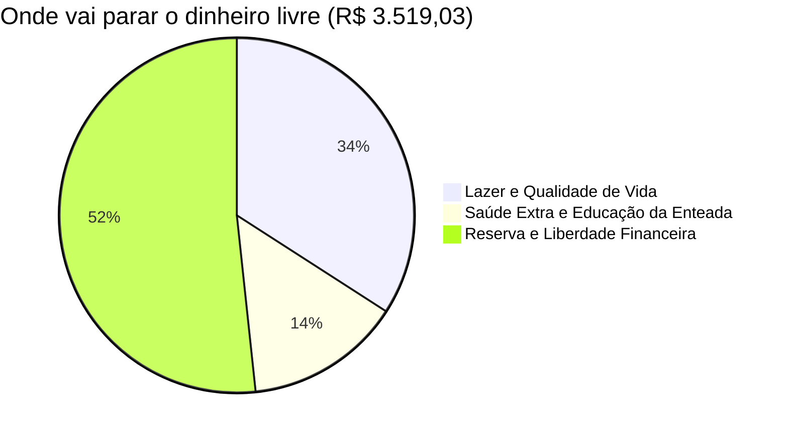

# 🏛️ Dashboard de Preparação: ALE-RR (Assistente Legislativo)

> [!info] 🎯 DADOS GERAIS DO PROJETO (Edital Nº 02/2026 — Cargo 38)
> | Campo | Informação |
> | :--- | :--- |
> | **Órgão** | Assembleia Legislativa do Estado de Roraima (ALE-RR) |
> | **Cargo** | Técnico Legislativo – Assistente Legislativo (Código 38) |
> | **Banca** | Fundação Carlos Chagas (FCC) |
> | **Prova** | Apenas Objetiva 📝 (*NÃO há redação!*) |
> | **Data da Prova** | 28 de Junho de 2026 |
> | **Inscrições** | 06/04 a 06/05/2026 |

---

## 💵 Painel Financeiro e Orçamento Familiar
*(Cenário simulado para Titular + 2 Dependentes: Esposa e Enteada)*

> [!success] 📈 FLUXO DE CAIXA MENSAL (DADOS CONFIRMADOS DO EDITAL)
> | Categoria | Descrição | Total |
> | :--- | :--- | ---: |
> | ➕ **Vencimento Básico** | Confirmado pelo Edital 02/2026 | **R$ 5.815,15** |
> | ➕ **Auxílio-Alimentação** | Confirmado pela ALE-RR | **R$ 1.498,00** |
> | ➕ **Auxílio-Saúde** | Confirmado pela ALE-RR | **R$ 1.000,00** |
> | 🔴 **Total Bruto** | | **R$ 8.313,15** |
> | ➖ **INSS (~14%)** | Incide só sobre o vencimento base | **R$ -814,12** |
> | ➖ **IRRF** | Reduzido por 2 dependentes legais | **R$ -220,00** |
> | 🟢 **LÍQUIDO NA CONTA** | O que cai livre todo mês | **R$ 7.279,03** |

 

> [!warning] 🏠 CUSTO DE VIDA ATUAL (Valores Informados)
> | Despesa | Valor Mensal |
> | :--- | ---: |
> | Casa (Aluguel/Parcela) | R$ 1.200,00 |
> | Rancho (Alimentação) | R$ 1.000,00 |
> | Energia Elétrica | R$ 750,00 |
> | Contas (Internet/Água) | R$ 110,00 |
> | Gasolina | R$ 700,00 |
> | **TOTAL CUSTO FIXO** | **R$ 3.760,00** |

 

> [!success] 🟢 SALDO LIVRE MENSAL (A Matemática da Vitória!)
> **R$ 7.279,03 — R$ 3.760,00 = 💰 R$ 3.519,03 SOBRANDO TODO MÊS**

### 🥧 Distribuição Estratégica do Saldo Livre

> [!tip] 🚀 ACELERADOR: Os Serviços por Fora (Side Jobs)
> A carga horária concentrada da ALE-RR (6 a 8h/dia, sextas tranquilas, fins de semana livres) permite que você mantenha seus **serviços autônomos ativos** à tarde e à noite. É 100% legal.
>
> Injetando + **R$ 2.000 a R$ 3.000** dos seus "corres" na fatia de Reserva Financeira → seu caixa de construção de patrimônio mensal ultrapassa **R$ 4.800/mês**. O salário garante o conforto; os corres constroem a riqueza!

---

## 📋 Matérias do Edital (Conteúdo Programático Oficial — Cargo 38)

> [!abstract] 📚 CONHECIMENTOS GERAIS
> - **Língua Portuguesa:** Ortografia, acentuação, crase, interpretação de texto, morfossintaxe, concordância, regência, pontuação, figuras de linguagem, teoria da argumentação, vícios de raciocínio.
> - **Legislação Institucional:** Const. RR (arts. 30-67 e 111-116) | RI ALE-RR (Res. nº 08/2023) | Código de Ética Parlamentar (Res. nº 29/1995) | Res. nº 015/2024 | **LCE nº 373/2026**.
> - **Geografia e História de Roraima:** Ocupação territorial, fronteiras, fluxos migratórios, municípios, povos indígenas, governadores, clima, solos, hidrografia, economia (agropecuária, mineração, etc.).

> [!example] 🎯 CONHECIMENTOS ESPECÍFICOS
> - **Noções de Direito Constitucional:** Normas constitucionais, eficácia, Direitos Fundamentais, organização político-administrativa, Poderes (Executivo, Legislativo, Judiciário), funções essenciais à Justiça (MP, Adv. Pública, Defensoria).
> - **Noções de Direito Administrativo:** Organização administrativa (centralização, descentralização), Adm. Direta e Indireta, Ato Administrativo, Agentes Públicos, **LCE nº 053/2001**, Poderes Adm., Licitações (**Lei 14.133/2021**), Controle, Responsabilidade Civil do Estado, **LGPD (Lei 13.709/2018)**.
> - **Noções de AFO:** Conceito de Orçamento, Princípios Orçamentários, **PPA/LDO/LOA**, Ciclo Orçamentário, Receita e Despesa Pública, Sistema **SIAFIC-RR**.
> - **Noções de Administração Pública:** Modelos (Patrimonialismo, Burocracia, Gerencial), Reformas do Estado, Governança, Gestão de Pessoas, Ética no Setor Público, Gestão por Processos, Governo Eletrônico.
> - **Noções de Processo Legislativo:** CF Art. 21-24, **Art. 44-75**, Art. 84 | **Const. RR Arts. 38-44**.
> - **Noções de Legística:** **LC nº 95/1998** | **Dec. nº 12.002/2024** | LINDB (Dec.-Lei nº 4.657/42) | Dec.-lei nº 9.830/2019.

---

## 📅 Central de Afazeres (To-Do Semanal)

> [!todo] ⚔️ MISSÕES EM ABERTO
> - [ ] **AFO:** Estudar e resumir o Ciclo da Despesa (4 estágios).
> - [ ] **AFO:** Fixar os Princípios Orçamentários (mnemônico).
> - [ ] **AFO:** Diferença entre PPA, LDO e LOA.
> - [ ] **Dir. Constitucional:** Poderes Legislativo e Processo Legislativo (Arts. 44-75 CF).
> - [ ] **Legística:** Ler LC 95/1998 (estrutura das leis, artigos, incisos, parágrafos).
> - [ ] **Dir. Administrativo:** Ato Administrativo (conceito, requisitos, atributos e espécies).
> - [ ] **LCE 053/2001:** Ler o Estatuto do Servidor — Direitos e deveres.
> - [ ] **RI ALE-RR:** Estrutura da Mesa Diretora e tipos de sessão.
> - [ ] **Geohist. Roraima:** Revisão de municípios, governadores e economia.
> - [ ] **Português:** Resolver 30 questões de concordância e regência verbal.
> - [ ] Fazer 50 questões FCC de AFO + Processo Legislativo esta semana.
> - [ ] Revisitar o `Resultado_ProcLeg_Sessao_01.md` e corrigir os erros.

---

## 🎭 Mindset Profissional (O Mapa da Paz)

> [!quote] A "Persona" Matadora do Assistente Legislativo
> 1. **A Esfinge:** Você lidará com documentos de alta polêmica política. Seja cego e surdo quando sair do prédio. Jamais repasse fofocas ou documentos.
> 2. **O Burocrata de Gelo:** O erro nas urnas penaliza o Político. O erro burocrático penaliza **você**. Se faltar a assinatura do Art. 3, o processo retorna. Seja inflexível com o Regimento — sempre com educação.
> 3. **Ego Zero:** Não queira aparecer. O show é dos deputados. O Assistente faz o trabalho desaparecer perfeitamente, enquanto o cheque engorda a poupança.
> 4. **Diplomacia Blindada:** Quando o assessor pressionar: *"Meu amigo, eu adoraria liberar isso, mas o sistema acusaria inconsistência sem essa assinatura e travaria o projeto do Deputado. Traga que processo hoje mesmo!"*

---
*Atualizado em: 20/04/2026 | Fonte: Edital ALE-RR nº 02/2026 (FCC)*
