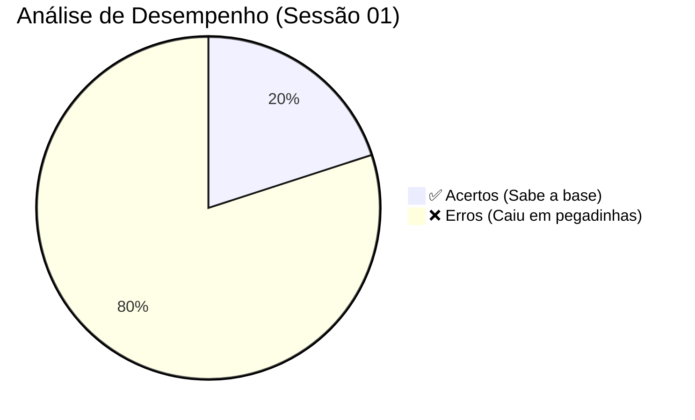

# 📊 Dashboard de Desempenho: 18/04/2026

> [!error] ⚠️ ALERT: REVISÃO PROFUNDA NECESSÁRIA!
> **Acertos:** 2/10 (Questões 01 e 10)
> **Aproveitamento Geral:** 20%

### 🎯 Visão da Sessão

---

## 🛡️ Debriefing de Combate (Correção Rápida)

> [!success] ✅ ONDE VOCÊ FOI BEM (Acertos Estratégicos)
> *   **Q01 (A Lista):** Você acertou a base da pirâmide. Já sabe identificar quais são as "ferramentas" típicas de uma Assembleia Legislativa.
> *   **Q10 (O Rito da PEC):** Mostrou que entendeu a supremacia da Assembleia. Você marcou certo ao lembrar que **PEC não vai para o Governador sancionar**.

> [!fail] ❌ ONDE A BANCA TE DERRUBOU (Ajustes de Mira)
> *   **Q02 (Maiorias):** Você confundiu os pesos. Marcou que Lei Complementar é maioria simples, mas a verdade é que **Lei Complementar exige Maioria Absoluta** (metade de todos os deputados eleitos).
> *   **Q08 (Sanção/Veto - O Famoso Erro):** Você pensou que o Decreto Legislativo precisava do Governador. Lembre-se: Decretos Legislativos e Resoluções são **100% internos e da própria Assembleia**, sem pitaco do Governador!
> *   **Q06 (Legística):** Achou que era obrigatório ter um Parágrafo antes de abrir uma lista (Incisos). A realidade é que um Artigo pode iniciar a lista de incisos diretamente.

---

## 🚀 Plano de Ação Tático (Próximos Passos)

> [!todo] ⚔️ MISSÕES DE CORREÇÃO
> - [ ] Reler o arquivo `Diario_Estudo_18-04-2026.md` onde essas dúvidas foram solucionadas definitivamente.
> - [ ] Fazer uma lista rápida num papel: As 3 coisas que NÃO precisam da assinatura do Governador (PEC, Decreto Legislativo, Resolução).
> - [ ] Fazer a Sessão 02 focado só na diferença de Maioria Simples e Absoluta.

---
[[Roteiro Mestre - ALE-RR|⬅️ Voltar ao Roteiro Mestre]]
