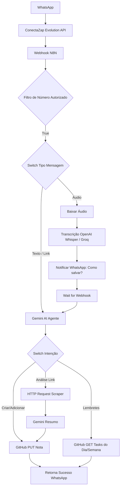

# 🤖 Bot Obsidian via WhatsApp (V2 Avançado)

> **Objetivo:** Assistente pessoal com inteligência artificial capaz de transcrever áudios, analisar links, buscar lembretes e salvar notas no Obsidian via GitHub API.

---

## 1. ARQUITETURA GERAL (V2)



---

## 2. NOVOS COMANDOS MAPEADOS (Intenções do Gemini)

| Comando / Intenção | O que acontece |
|---|---|
| `/salva` ou conversa livre | Cria nota no Domínio Intelectual |
| `/daily` | Adiciona entrada no log da Daily Note de hoje |
| `/lembrete hoje` ou `/lembrete semana` | Busca e retorna tarefas abertas (`- [ ]`) nas Daily Notes ou Painéis. |
| `/analise [Link]` | O bot acessa a URL, extrai o conteúdo da página, resume e salva no Vault. |
| `[Áudio enviado]` | Bot transcreve o áudio automaticamente e pergunta em qual pasta você quer salvar. |

---

## 3. CONFIGURAÇÕES DOS NOVOS NÓS (N8N)

### A. Transcrição de Áudio (Áudio Node)
- **Pré-requisito:** Obter a URL de download do áudio no payload do ConectaZap.
- **Nó de HTTP Request:** Fazer GET na URL do áudio passando o Header `apikey: SUA_API_KEY_CONECTAZAP`.
- **Nó OpenAI / Groq:** Usar o nó nativo de IA (ou HTTP Request para API Whisper) passando o arquivo binário recebido para transcrição (`speech-to-text`).
- **Nó Wait (Esperar Resposta):** O N8N enviará uma mensagem *"Áudio transcrito: [TEXTO]. Digite 1 para Daily, 2 para Pessoal..."*. O nó Wait pausará o fluxo aguardando o ConectaZap bater num Webhook temporário com a resposta.

### B. Sistema de Lembretes (GitHub GET Node)
- O Gemini deverá classificar a intenção como `buscar_lembretes`.
- **Nó HTTP Request (GitHub API):**
  - **Método:** GET
  - **URL (Hoje):** `https://api.github.com/repos/ismaelsantos0/obsidian-vault/contents/Daily_Gravity/YYYY-MM-DD.md`
- **Nó JavaScript (Filtro):** Decodifica o base64 retornado pelo GitHub e usa Regex `/- \[ \].*/g` para capturar apenas as tarefas não concluídas.

### C. Análise de Link Web Scraping
- O Gemini classifica a intenção como `analise_link` e extrai a `url` para um campo JSON separado.
- **Nó HTTP Request / HTML Extract:**
  - Baixa o HTML da URL recebida.
  - O HTML Extract Node extrai apenas as tags `<p>`, `<h1>`, `<h2>`.
- **Nó Gemini 2 (Resumo):** Recebe o texto extraído da web e faz a sumarização antes de enviar para o nó final de salvar no Obsidian.

---

## 4. VARIÁVEIS DE AMBIENTE ATUALIZADAS (N8N)

```env
GITHUB_TOKEN=ghp_XXXXXXXXXXXXXXXXXXXX
GITHUB_REPO=ismaelsantos0/obsidian-vault
CONECTAZAP_API_KEY=SUA_KEY_AQUI
CONECTAZAP_URL=https://seu-conectazap.com
INSTANCIA_BOT=nome-da-instancia-bot
MEU_NUMERO=5595XXXXXXX@s.whatsapp.net
GEMINI_API_KEY=AIzaSy_XXXXXXXXXXXXXXXXXXXX
OPENAI_API_KEY=sk-proj-XXXXXXXXXXXXXXXXX # Para transcrição de áudio
```
